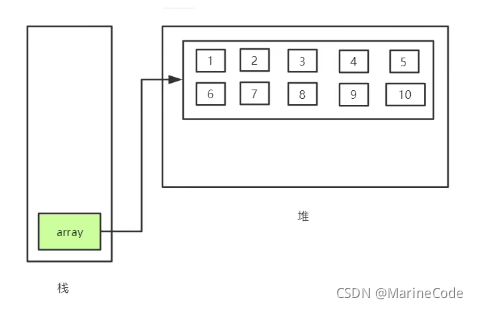

**数组的定义**
数组是相同类型数据结构的有序集合，数组描述的是相同类型的若干数据，按照一定的先后次序排列组合而成，其中，每一个数据称作一个数组元素，每个数组元素可以通过一个下标来访问它们。

**Java内存分析：**
堆区：存放 new 的对象和数组，可以被所有线程共享，不会存放别的对象引用
栈区：存放基本变量类型（包含这个基本类型的具体数值），引用对象的变量（存放这个引用在堆里的具体地址）
方法区：可以被所有线程共享，包含了所有的 class 和 static 变量

**三种初始化**
静态初始化；动态初始化；数组默认初始化（数组是引用类型，它的元素相当于类的实例变量，因此数组一经分配空间，其中的每个元素也被按照实例变量的同样的方式被隐式初始化）

**数组的4个基本特点**
其长度是确定的，数组一旦被创建，它的大小就是不可改变的
数组元素必须是相同类型，不允许出现混合类型
数组中的元素可以是任何数据类型，包括基本类型和引用类型
数组变量属于引用类型，数组也可以看成是对象，数组中的每个元素相当于该对象的成员变量。数组本身就是对象，Java中对象是在堆中的，因此数组无论保存原始类型还是其他对象类型，数组对象本身是在堆中的

